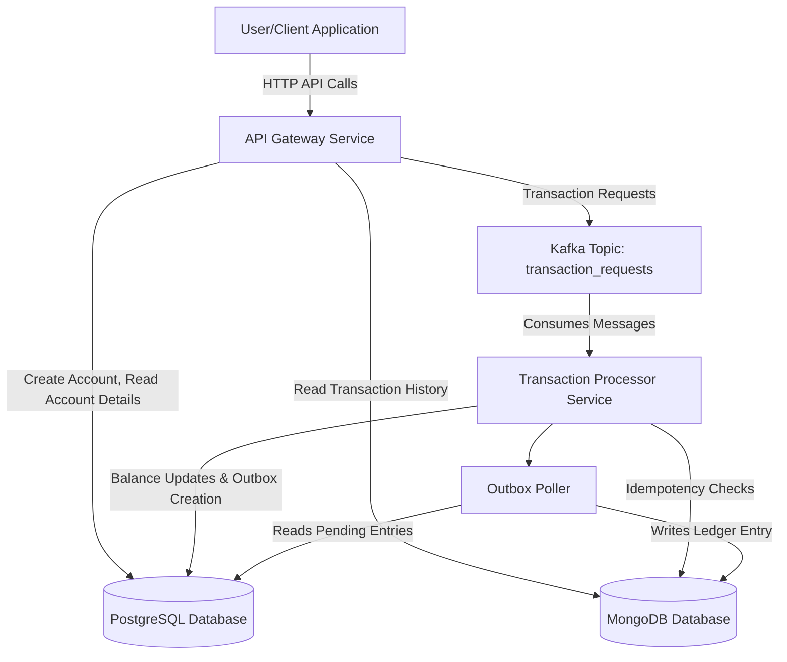

# Banking Ledger Service

A robust, scalable, and resilient backend implementation for a banking ledger system. It meticulously manages bank accounts and transactions, designed to serve a frontend application. This project, developed as a take-home assessment, showcases advanced engineering practices focusing on data integrity, high availability, fault tolerance, and adherence to modern software design principles.

## Features

- **Account Management**: Create accounts with specified initial balances and National ID verification
- **Highly Consistent Transaction Processing**: Facilitate deposits and withdrawals with strong consistency guarantees (ACID-like properties for critical operations) and robust idempotency.
- **Transaction Logging**: Maintain a detailed, append-only transaction log (ledger) for each account in MongoDB, optimized for audit and history.
- **Consistency Guarantees**: Prevent double spending or inconsistent balances
- **Horizontal Scalability**: Designed to handle high spikes in transaction volume
- **Asynchronous Processing**: Utilize Kafka for efficient transaction request management
- **Comprehensive API**: Endpoints for creating accounts, processing transactions, and retrieving transaction history
- **Idempotency Support**: Prevent duplicate transactions with client-provided idempotency keys.
- **Dual Database Strategy**: Optimized data storage using PostgreSQL for relational account data (balances, owner information) and MongoDB for high-volume, append-only transaction logs (ledger).
- **Pessimistic Locking for Consistency**: Ensures strong consistency for critical balance update operations via `SELECT FOR UPDATE` in PostgreSQL.
- **Graceful Shutdown**: Services are designed to shut down gracefully, ensuring pending tasks are completed and resources are released properly.
- **Resilient Asynchronous Processing**: Utilizes Kafka for efficient, decoupled transaction request management, with fine-grained consumer control (e.g., manual offset commits) for enhanced reliability.

## Tech Stack

- **Languages/Frameworks**: Golang
- **Databases**: 
  - PostgreSQL (for accounts, outbox)
  - MongoDB (for ledger entries)
- **Messaging**: Apache Kafka
- **Containerization**: Docker, Docker Compose
- **API Documentation**: OpenAPI (Swagger)


## Architecture Overview

The Banking Ledger Service follows a microservices architecture with two main services:

### API Gateway
Handles incoming HTTP requests, validates them, interacts with databases for synchronous operations (account creation/reads), and publishes transaction requests to Kafka.

### Transaction Processor
Consumes transaction requests from Kafka, performs business logic (balance updates, idempotency checks), updates account balances in PostgreSQL, and records ledger entries in MongoDB using the Transactional Outbox pattern.

### Outbox Poller
A component within the Transaction Processor that reads from the PostgreSQL outbox table and ensures ledger entries are written to MongoDB.

### Data Flow



### Key Patterns Implemented

- **Microservices Architecture**: Decoupled API Gateway and Transaction Processor services
- **API Gateway Pattern**: Single entry point for client interactions
- **Asynchronous Messaging**: Kafka for decoupling transaction submissions from processing
- **Transactional Outbox Pattern**: Ensures atomicity between primary data changes and event publishing
- **Repository Pattern**: Abstracts data access logic
- **Dependency Injection**: Promotes loose coupling and testability
- **Separation of Concerns**: Transaction Processor broken down into specialized components

## Project Structure

```
.
├── api/                    # OpenAPI specification
├── cmd/                    # Application entry points
│   ├── api_gateway/        # API Gateway service main package
│   └── transaction_processor/ # Transaction Processor service main package
├── configs/                # Environment configuration files
├── deployments/            # Dockerfiles
├── internal/               # Core application logic
│   ├── api_gateway/        # API Gateway components
│   ├── config/             # Configuration management
│   ├── data/               # Data access layer implementations
│   ├── domain/             # Domain models and repository interfaces
│   ├── logger/             # Logging utilities
│   ├── platform/           # Platform integrations (Kafka, databases)
│   └── transaction_processor/ # Transaction Processor components
├── migrations/             # Database schema migrations
├── Makefile                # Common development tasks
└── docker-compose.yml      # Multi-container application definition
```

## Prerequisites

- Go (version 1.23 or higher)
- Docker Engine and Docker Compose


## Getting Started & Installation

1. Clone the repository:
   ```bash
   git clone <your-repository-url>
   cd innoscripta-banking-ledger
   ```

2. Ensure Docker is running on your system.

## Running the Application

### Using Docker Compose (Recommended)

1. Start all services (PostgreSQL, Kafka, MongoDB, API Gateway, Transaction Processor):
   ```bash
   make run
   ```
   Services will run in detached mode. To view logs: `docker-compose logs -f`


2. Stop the application:
   ```bash
   make down
   ```

### Running Services Locally for Development

1. Ensure PostgreSQL, Kafka, and MongoDB are running (via Docker or locally).

2. Build the Go applications:
   ```bash
   make build
   ```

3. Run the services:
   ```bash
   make run-dev
   ```

4. Stop the locally running services:
   ```bash
   make stop-dev
   ```

## Running Tests

Run all unit and integration tests:
```bash
make test
```

Run tests with code coverage and view HTML report:
```bash
make test-coverage
```

Run linting:
```bash
make lint
```

## API Endpoints

The API is documented using OpenAPI 3.0. The specification file is located at `api/openapi.yaml`.

The API Gateway serves endpoints under the base path `/api/v1`.

### Key Endpoints

#### Accounts
- `POST /accounts`: Create a new bank account
- `GET /accounts/{id}`: Retrieve details for a specific account
- `GET /accounts/{id}/transactions`: Retrieve transaction history for an account (supports pagination)

#### Transactions
- `POST /transactions`: Initiate a new deposit or withdrawal transaction
- `GET /transactions/{id}`: Retrieve details for a specific transaction

#### Health Check
- `GET /health`: Check the health status of the API Gateway


## Key Design Decisions & Patterns

### Microservice Architecture
The system is composed of distinct services (API Gateway, Transaction Processor) that can be scaled independently.

### Asynchronous Processing
Kafka is employed for decoupling the API Gateway from the Transaction Processor. This not only enables resilience and scalability but also includes robust message handling with manual offset commits in the consumer, providing precise control over message acknowledgment and retry mechanisms, crucial for financial transactions.

### Transactional Outbox Pattern
Guarantees data consistency across distributed services and heterogeneous data stores (PostgreSQL and MongoDB). An outbox table in PostgreSQL, updated atomically with account changes, is polled by a dedicated component (`OutboxPoller`) within the Transaction Processor. This ensures that ledger entries in MongoDB are reliably created only after the primary transaction succeeds, preventing data loss or inconsistencies in an event-driven flow.

### Repository Pattern
Used for data access abstraction with interfaces defined in the domain layer and implementations in the data layer.

### Dependency Injection
Repository interfaces are injected into services, promoting loose coupling and testability.

### Separation of Concerns
Adherence to SOLID principles is exemplified by the Transaction Processor's architecture. It was refactored from a monolithic service into a set of cohesive, specialized components, each with a single responsibility, exposed via interfaces:
- `TransactionValidator`: Handles transaction validation and idempotency checks.
- `AccountManager`: Manages account locking, balance updates, and versioning.
- `OutboxManager`: Handles outbox entry creation for reliable event propagation.
- `FailureRecorder`: Records failed transactions consistently in the ledger.
This design significantly enhances modularity, testability, and maintainability of the core transaction logic.

### Idempotency Implementation
Idempotency is handled at two levels:
1.  **API Gateway**: Before publishing a transaction request to Kafka, the API Gateway checks if a transaction with the same idempotency key already exists in the MongoDB ledger. If found, it returns the existing transaction details, preventing duplicate message publication.
2.  **Transaction Processor**: As a secondary check, the Transaction Processor also verifies idempotency before processing a message from Kafka. This ensures that even if a duplicate message somehow reaches the processor, it won't be processed multiple times.

### Pessimistic Locking
To ensure strong consistency during critical operations like account balance updates, the Transaction Processor uses `SELECT ... FOR UPDATE` statements in PostgreSQL. This locks the relevant account row, preventing concurrent modifications and ensuring that balance calculations are based on the most up-to-date information.

### Graceful Shutdown
Both the API Gateway and Transaction Processor are designed for graceful shutdown. They listen for interrupt signals (SIGINT, SIGTERM) and, upon receiving one, will:
- Stop accepting new requests/messages.
- Attempt to complete any in-flight processing.
- Close database connections and other resources cleanly.
- Wait for goroutines to finish their work using `sync.WaitGroup`.
This ensures data integrity and prevents abrupt termination that could leave the system in an inconsistent state.

### Configuration Management
Configuration is managed via environment variables, facilitated by the `internal/config` package. Each service (`api_gateway`, `transaction_processor`) has its own environment file (e.g., `configs/api_gateway.env.local`) for local development. Dockerfiles are set up to load these configurations.

### Structured Logging
A centralized logging utility (`internal/logger`) provides structured logging (e.g., JSON format) with contextual information like correlation IDs, service names, and request details. This is crucial for debugging and monitoring in a distributed system.

### Database Migrations
PostgreSQL schema changes are managed using `golang-migrate/migrate`. Migration files are located in `migrations/postgres/` and can be applied using Makefile commands (e.g., `make migrate-up`).
### Factory Pattern
Used for constructing components of the Transaction Processor.

### Centralized Interface Definitions
Service interfaces and platform component interfaces are centralized in dedicated files for better discoverability.

## Code Quality & Best Practices

- **DRY (Don't Repeat Yourself)**: Common code is refactored into utility functions or shared packages
- **KISS (Keep It Simple, Stupid)**: Simple, clear solutions are favored over complex ones
- **SOLID Principles**: Components have single responsibilities, interfaces are used for decoupling
- **Code Formatting**: Enforced using `gofmt`
- **Linting**: `golangci-lint` is used for static analysis
- **Testing**: Focus on unit and integration tests
- **Error Handling**: Consistent error handling and propagation

## Areas of Enhancement (If I had more time)

- **Comprehensive Testing Strategy**: Expand test coverage to include end-to-end feature tests and performance stress tests to validate system behavior under various load conditions and edge cases.

- **Enhanced Error Handling Framework**: Implement a more sophisticated error handling system with detailed error categorization

- **Outbox Pattern Optimization**: Consider extracting the outbox polling mechanism into a dedicated microservice to improve scalability and maintenance, while potentially implementing a more efficient polling strategy.

- **Extended Documentation Coverage**: Enhance documentation with detailed architectural decision records (ADRs)
